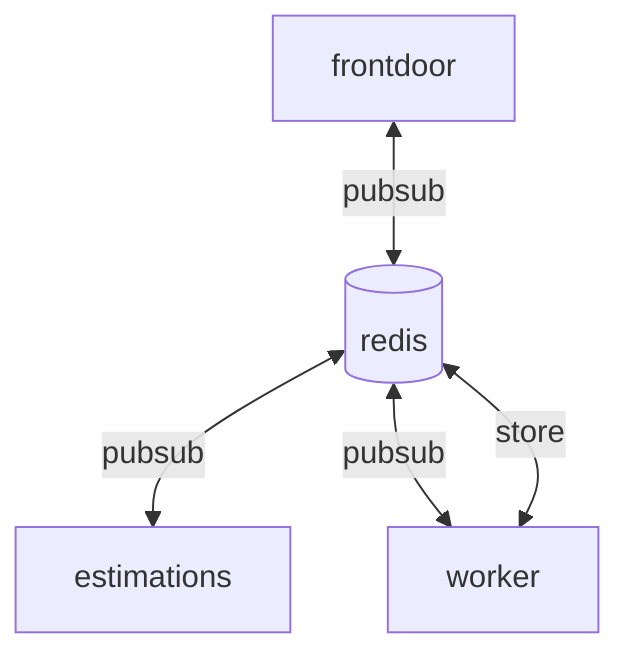

# micro-services

### Description
Micro-services example

### Runbook

- Run the app within `docker-compose`
```bash
$ docker-compose up -d
```
- Call the app
```bash
# to get a list of estimations
$ curl 'http://localhost:3000/'
# to generate a new estimation
$ curl --request POST 'http://localhost:3000/'
# to remove all estamations
$ curl --request DELETE 'http://localhost:3000/'
```

### Design Diagram


